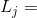
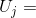

# sql_demos / fan_foot

This project stores the SQL code for solutions to interesting problems I have looked at on my blog, or elsewhere. It includes installation scripts with component creation and data setup, and scripts to run the SQL on the included datasets.
<br><br>

The `fan_foot` subproject has SQL and PL/SQL solutions to Fantasy Football problems problems as discussed in the following blog post:
<br>

- [SQL for the Fantasy Football Knapsack Problem, June 2013](http://aprogrammerwrites.eu/?p=878)

[Back to main README: sql_demos](../README.md)
## In this README...
- [Prerequisites](https://github.com/BrenPatF/Sandbox/blob/master/fan_foot/README.md#prerequisites)
- [Install steps](https://github.com/BrenPatF/Sandbox/blob/master/fan_foot/README.md#install-steps)
- [Fantasy Football problems](https://github.com/BrenPatF/Sandbox/blob/master/fan_foot/README_fft.md#balanced-number-partitioning-problems)
	- [Example: 6 Items, 2 Categories](https://github.com/BrenPatF/Sandbox/blob/master/fan_foot/README_bnp.md#example-four-items)
	- [Running the fan_foot scripts](https://github.com/BrenPatF/Sandbox/blob/master/fan_foot/README_bnp.md#running-the-fan_foot-scripts)

## Prerequisites
In order to install this subproject you need to have executed the first two parts of the installation in [main README: sql_demos](../README.md), i.e. `Install prerequisite modules` and `Create sql_demos common components`. If you executed the third part, `Subproject install steps`, you will have already installed this subproject and can run the scripts directly, see `Running the script` sections below.

## Install steps
- Update the login script fan_foot.bat with your own connect string
- Run script from slqplus:
```
SQL> @install_fan_foot
```
## Fantasy Football problems
- [In this README...](https://github.com/BrenPatF/Sandbox/blob/master/fan_foot/README_bnp.md#in-this-readme)
- [Example: 6 Items, 2 Categories](https://github.com/BrenPatF/Sandbox/blob/master/fan_foot/README_bnp.md#example-four-items)
- [Running the fan_foot scripts](https://github.com/BrenPatF/Sandbox/blob/master/fan_foot/README_bnp.md#running-the-fan_foot-scripts)

Fantasy Football problems are a form of bin-fitting problem in which the aim is .

The blog post considers 

I illustrated the problem and the results from :

    Let I be a set of items, identified by positive integers i = 1,...,|I|
	    For each i in I, let:
<br>
<blockquote>
         price of item i<br>
        &nbsp&nbsp&nbsp&nbsp value of item i
</blockquote>
<p align="center">
</p>

    Let C be a set of categories, identified by positive integers j = 1,...,|C|
	    For each category j in C, define bounds on the numbers of items for category j, let:
<p align="center">
		  lower bound for category j
</p>
<p align="center">
		  upper bound for category j
</p>
Let ic be a function representing the item-category links:
	For each item i in I, and category j in C,  let:
		ic(i,j) = 1 if item i is of category j
		        = 0 if item i is not of category j
	Where, for each item i in I, the item is of exactly one category:
		SUM[j in C]ic(i,j) = 1
Let S and P represent limits on the cardinality and total price of subsets of I, respectively:
		S = allowed cardinality of subsets of I
		P = maximum total price of subsets of I

With this notation, we can define F, feasible subsets of I for our problem as subsets satisfying the following constraints:

		SIZE: |F| = S
		PL: SUM[i in F]p(i) <= P
		Foreach j in C: 
			CAT-j: L(j) <= SUM[i in F]ic(i,j) <= U(j)


In the fantasy football examples below, the item is the player and the category is the position.


### Example: 6 Items, 2 Categories
- [Fantasy Football problems](https://github.com/BrenPatF/Sandbox/blob/master/fan_foot/README_bnp.md#balanced-number-partitioning-problems)

 price of item i
<br>
 value of item i

Here we see that the Greedy Algorithm finds the perfect solution, with no difference in bin size, but the two variants have a difference of two.

### Example: Six Items
- [Fantasy Football problems](https://github.com/BrenPatF/Sandbox/blob/master/fan_foot/README_bnp.md#balanced-number-partitioning-problems)


Here we see that none of the algorithms finds the perfect solution. Both the standard Greedy Algorithm and its batched variant give a difference of two, while the variant without rebalancing gives a difference of four.

### Running the fan_foot scripts
- [Fantasy Football problems](https://github.com/BrenPatF/Sandbox/blob/master/fan_foot/README_bnp.md#balanced-number-partitioning-problems)

[Schema: fan_foot; Folder: fan_foot]

The scripts solve .

The first script is for a smaller value of N_ITEMS = 100, and the query script lists the full solutions.
```
SQL> @main_sml
```
The above script runs the following two lines:
```
	@pop_data_bnp 100
	@run_queries_bnp 3
```

The second script is for a larger value of N_ITEMS = 10000, and the query script lists the solutions grouped by bin.
```
SQL> @main_big
```
The above script runs the following two lines:
```
	@pop_data_bnp 10000
	@run_queries_agg_bnp 3
```
