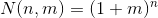

# sql_demos / knapsack

This project stores the SQL code for solutions to interesting problems I have looked at on my blog, or elsewhere. It includes installation scripts with object creation and data setup, and scripts to run the SQL on the included datasets.
<br><br>

The knapsack subproject has SQL solutions to single and multiple knapsack problems as discussed in the following blog posts:
<br>

- [A Simple SQL Solution for the Knapsack Problem (SKP-1), January 2013](http://aprogrammerwrites.eu/?p=560)
- [An SQL Solution for the Multiple Knapsack Problem (SKP-m), January 2013](http://aprogrammerwrites.eu/?p=635)

[Back to main README: sql_demos](../README.md)
## In this README...
- [Prerequisites](https://github.com/BrenPatF/Sandbox/blob/master/knapsack/README.md#prerequisites)
- [Install steps](https://github.com/BrenPatF/Sandbox/blob/master/knapsack/README.md#install-steps)
- [Knapsack problems](https://github.com/BrenPatF/Sandbox/blob/master/knapsack/README.md#knapsack-problems)
	- [One-knapsack problem](https://github.com/BrenPatF/Sandbox/blob/master/knapsack/README.md#one-knapsack-problem)
	- [Multi-knapsack problem](https://github.com/BrenPatF/Sandbox/blob/master/knapsack/README.md#multi-knapsack-problem)

## Prerequisites
In order to install this subproject you need to have executed the first two parts of the installation in [main README: sql_demos](../README.md), i.e. `Install prerequisite modules` and `Create sql_demos common components`. If you executed the third part, `Subproject install steps`, you will have already installed this subproject and can run the scripts directly, see `Running the script` sections below.

## Install steps
- Update the login script knapsack.bat with your own connect string
- Run script from slqplus:
```
SQL> @install_knapsack
```
## Knapsack problems
The problem in general is to maximise profit from packing items, from a set of n items, into m containers while respecting capacity limits on the containers. The difficulty of the problem arises from the number of possible combinations increasing exponentially with problem size. The number of assignments of n items into m containers, disregarding capacity limits, is:



This can be seen by noting that the number is equal to the number of ways of choosing one container from m, or none (making m + 1), for each of n items independently.

### One-knapsack problem
- [In this README...](https://github.com/BrenPatF/Sandbox/blob/master/knapsack/README.md#in-this-readme)
In the blog mentioned above I look at a simple example problem having four items, with a weight limit of 9, as shown below:


There are 16 [N(4,1) = 2**4] possible combinations of these items, having from 0 to 4 items. These are depicted below:


We can see that there are two optimal solutions in this case, with a profit of 50.

How to find them using SQL? The blog post explains how it can be done in a number of different ways, and includes query diagrams, and performance analysis for a range of randomly generated larger data sets.

#### Running the script
The script solves the small example problem using several methods, and includes automatically generated execution plans. It also uses the Timer_Set module to time sections of the PL/SQL solution.
```
SQL> @main_kp1
```
### Multi-knapsack problem
- [In this README...](https://github.com/BrenPatF/Sandbox/blob/master/knapsack/README.md#in-this-readme)
For this case, I considered the same simple example item set as in the earlier article, having four items, but now with two containers with individual weight limits of 8 and 10.

We can again depict the 16 possible item combinations in a diagram, with the container limits added:


There are 81 assignments of 4 items to 2 containers, disregarding the capacity limits [N(4,2) = 3**4].

From the diagram we see that the first 7 combinations meet the container-1 limit of 8, while the first 10 meet the container-2 limit of 10. The task is to pick a pair of disjoint combinations from these sets that maximises profit. We can see that there is one optimal solution in this case, in which items 1 and 3 are assigned to container 1, while items 2 and 4 are assigned to container 2, with a profit of 100.

How to find it using SQL? The blog post explains how it can be done in a number of different ways, and includes query diagrams, and performance analysis for a range of randomly generated larger data sets.

#### Running the script
The script solves the small example problem using several methods, and includes automatically generated execution plans.
```
SQL> @main_kpm
```
